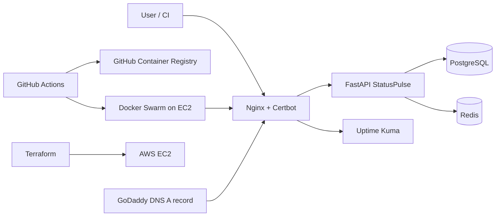

# StatusPulse

StatusPulse is a FastAPI status page and health monitoring API prepared for the Jr DevOps Engineer practical assessment.

## Architecture



## Prerequisites

- Docker and Docker Compose
- GNU Make
- curl
- A public GitHub repository
- For production: AWS account, EC2 key pair, GoDaddy domain, Slack webhook, and GitHub Actions secrets

## Local Development

```bash
cp .env.example .env
make build
make up
make test
```

Useful commands:

```bash
make logs
make shell
make down
make clean
```

The API runs at `http://localhost:8000`. Swagger docs are at `http://localhost:8000/docs`.

## Integration Tests

```bash
bash tests/test_integration.sh
```

The test script verifies:

- `GET /health`
- `POST /services`
- duplicate `POST /services` returns `409`
- `GET /services`
- `POST /incidents`
- `GET /incidents`

## CI/CD

`.github/workflows/ci.yml` runs on pushes and pull requests to `main`.

It performs:

- Python linting with `ruff`
- Dockerfile scan with `hadolint`
- Docker image build
- Full Docker Compose stack startup
- Integration tests against the live stack
- Test result artifact upload

`.github/workflows/deploy.yml` runs after CI succeeds on `main`.

It performs:

- Build and push image to GitHub Container Registry
- Tag image with commit SHA and `latest`
- SSH into the server
- Run `/opt/statuspulse/scripts/deploy-swarm.sh`
- Run health check and rollback through the deploy script
- Send Slack notification when `SLACK_WEBHOOK_URL` is configured

Required GitHub Actions secrets:

```text
DEPLOY_HOST
DEPLOY_USER
DEPLOY_SSH_KEY
DEPLOY_PORT
HEALTH_URL
SLACK_WEBHOOK_URL
```

## Production Deployment

1. Create the EC2 instance:

```bash
cd terraform
terraform init
terraform apply -var="key_name=YOUR_AWS_KEYPAIR"
```

2. In GoDaddy, create an `A` record pointing your domain or subdomain to the Terraform `server_public_ip` output.
3. Wait for DNS propagation:

```bash
dig +short YOUR_DOMAIN
```

4. Edit `ansible/inventory.ini` and `ansible/vars.yml`.
5. Run:

```bash
cd ansible
ansible-galaxy collection install community.general
ansible-playbook -i inventory.ini playbook.yml
```

The playbook installs Docker, initializes single-node Docker Swarm, configures SSH hardening, UFW, swap, unattended upgrades, Nginx, Certbot, StatusPulse, Uptime Kuma, health monitoring, and backup cron jobs.

After deployment:

```bash
curl -fsS https://YOUR_DOMAIN/health
curl -I https://YOUR_DOMAIN/
```

## Monitoring And Alerting

Uptime Kuma is exposed through Nginx at:

```text
https://YOUR_DOMAIN/status
```

Configure these monitors manually in the Uptime Kuma UI:

- StatusPulse `/health` every 60 seconds
- PostgreSQL TCP check on the internal or host-exposed port
- Redis TCP check on the internal or host-exposed port
- TLS certificate expiry

Configure Slack plus one additional free notification channel in Uptime Kuma. For the proof, stop the app service, capture down notifications, restart it, and capture recovery notifications.

The cron health monitor runs every 5 minutes:

```bash
crontab -l
tail -f /var/log/statuspulse-monitor.log
```

## Backup And Restore

Backups are created by:

```bash
APP_DIR=/opt/statuspulse /opt/statuspulse/scripts/backup.sh
```

Files are written as:

```text
statuspulse_db_YYYY-MM-DD_HHMMSS.sql.gz
```

Restore example:

```bash
postgres_container="$(docker ps --filter name=statuspulse_postgres --format '{{.ID}}' | head -n 1)"
gzip -dc /opt/statuspulse/backups/statuspulse_db_YYYY-MM-DD_HHMMSS.sql.gz \
  | docker exec -i "$postgres_container" psql -U "$DB_USER" "$DB_NAME"
```

## Security Notes

- Runtime container uses a non-root user.
- `.env` is ignored by Git.
- Production secrets are supplied through `.env` on the server and GitHub Actions secrets.
- Security headers and rate limiting are configured in `nginx/statuspulse.https.conf`.
- Nginx uses `limit_req` at `100r/m` with a small burst allowance.

## Proof Checklist

Create a `screenshots/` folder and add:

- `docker images` showing image under 200MB
- `docker compose ps` showing healthy services
- `curl localhost:8000/health`
- successful `make test`
- at least 3 successful CI runs
- one intentionally failed CI run
- successful deploy run
- GHCR image list with SHA tags
- live `/docs` over HTTPS
- `curl -vI https://YOUR_DOMAIN/`
- `sudo ufw status`
- hardened `sshd_config`
- successful deploy and rollback logs
- Uptime Kuma dashboard and public status page
- alert down/recovery notifications from two channels
- `crontab -l`
- monitor logs with at least one hour of entries
- IaC run output and idempotency proof
- backup and restore proof
- Trivy before/after scan
- security headers and rate limit demo

## Troubleshooting

Check container health:

```bash
docker compose ps
docker compose logs app
```

Check Swarm services:

```bash
docker service ls
docker service ps statuspulse_app
```

Check database connectivity:

```bash
docker compose exec postgres pg_isready -U statuspulse -d statuspulse
```

Check Redis:

```bash
docker compose exec redis redis-cli ping
```

Check production logs:

```bash
tail -f /var/log/statuspulse-deploy.log
tail -f /var/log/statuspulse-monitor.log
tail -f /var/log/statuspulse-backup.log
```
